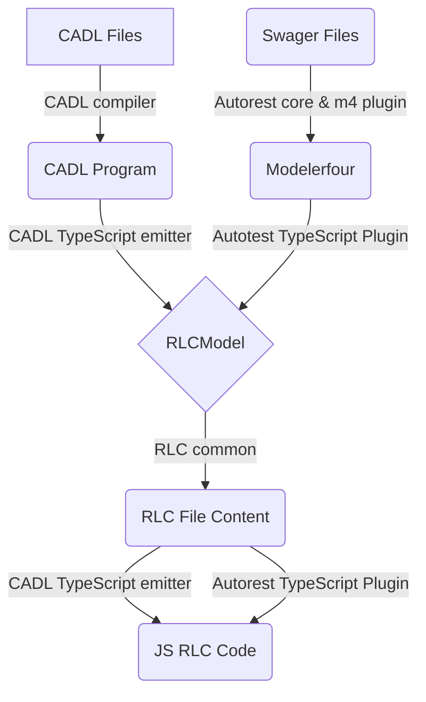
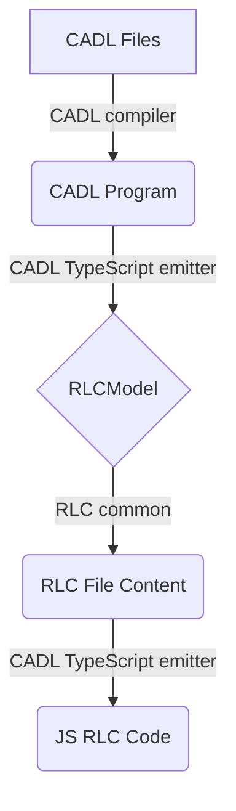

# RLC generation Design

## Basic Terms:
- **Cadl Files**: cloud service API definition written in CADL 
- **Swagger Files**: REST api specification written in OpenAPI.
- **CADL Program**: The model we get after CADL compiler has processed the cadl input.
- **Modelerfour**: The code model we get after autorest core and modelerfour plugin has processed the swagger input.
- **RLCModel**: The model we defined internally which contains all the necessary information we need to build the RLC file content.
- **CADL compiler**:
- **Autorest core & m4 plugin**: 
- **CADL TypeScript emitter**: This module transforms the CADL program into RLCModel.
- **RLC common**: The common part that takes RLCModel as input and build the RLC file content. 
- **Autorest TypeScript plugin**: This module transforms the Modelerfour into RLCModel.

## TypeScript RLC generation Design Overview

## CADL RLC generation part
