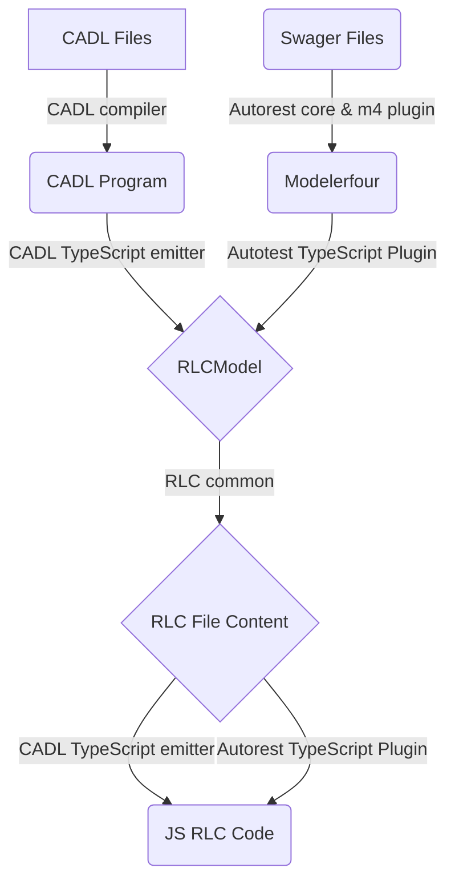
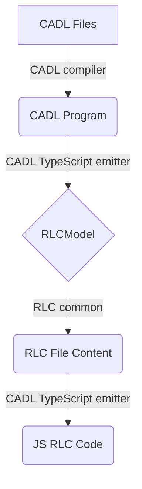
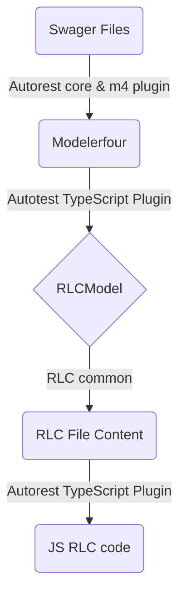

# RLC generation Design

## Basic Terms

- **Cadl Files**: cloud service API definition written in [CADL](https://github.com/microsoft/cadl).
- **Swagger Files**: REST api specification follow the definition in [OpenAPI](https://swagger.io/).
- **CADL Program**: The model we get after CADL compiler has processed the cadl input.
- **Modelerfour**: The code model we get after autorest core and modelerfour plugin has processed the swagger input.
- **RLCModel**: The model we defined internally which contains all the necessary information we need to build the RLC file content.
- **CADL compiler**: The module that compiles the cadl input and provides a set of APIs to CADL emitter to get the cadl program model.
- **Autorest core & m4 plugin**: The module that takes swagger files as input and output the code model modelerfour.
- **CADL TypeScript emitter**: This module transforms the CADL program into RLCModel.
- **RLC common**: The common part that takes RLCModel as input and build the RLC file content. 
- **Autorest TypeScript plugin**: This module transforms the Modelerfour into RLCModel.

## TypeScript RLC generation Design Overview

In the TypeScript RLC generator, we support generate RLC code from both cadl input and swagger input.

### CADL RLC generation part

On a high level, the entire Rest Level Client generation process from CADL Input would be:

Cadl Input -> Cadl Compiler -> Cadl Program -> Transform RLCModel -> Call RLC Common library to Generate Code

### Swagger RLC generation part

And the entire Rest Level Client generation process from Swagger Input would be:  
Swagger Input -> Autorest Core & m4 Plugin -> Modelerfour -> Transform RLCModel -> Call RLC Common library to Generate Code

