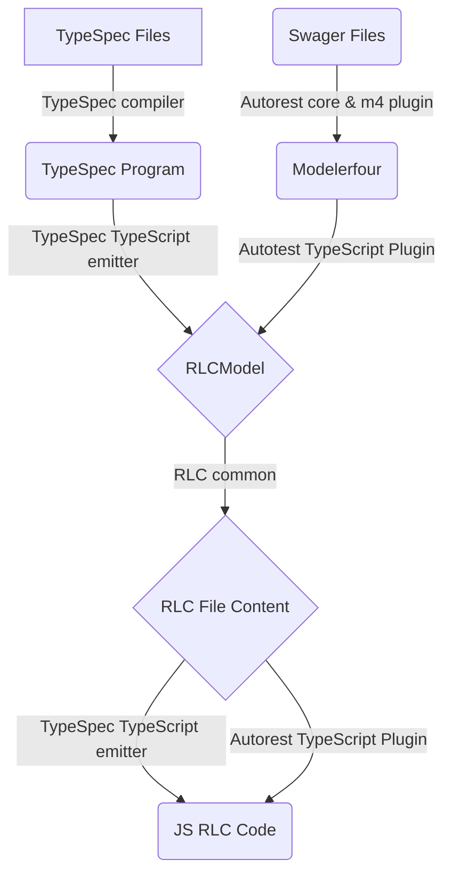
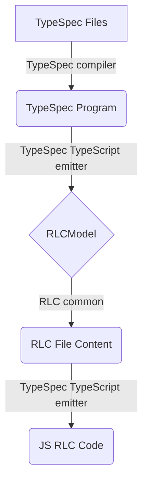

# RLC generation Design

## Overview

In the JavaScript/TypeScript RLC generator, we support generate RLC code from both TypeSpec input and Swagger input. This document will mainly talk about how the high level design of JavaScript/TypeScript Rest Level Client (RLC) generator looks like. we will first show the whole workflow and then introduce the RLC generation from TypeSpec and Swagger separately.

## Overall Workflow

Basically, the whole workflow is shown in the below flowchart.

## Basic Terms

To better understand the above flowchart, we list some basic terms here.

- **TypeSpec Files**: A Service API that is defined using the [TypeSpec](https://github.com/microsoft/typespec) language.
- **Swagger Files**: A REST api specification that follows the [OpenAPI](https://swagger.io/) definition.
- **TypeSpec Program**: An internal model that is provided after TypeSpec compiler has processed the TypeSpec input.
- **Modelerfour**: A code model that is provided after Autorest core and Modelerfour plugin have processed the swagger input.
- **RLCModel**: An internally defined model that contains all the necessary information required to build the RLC file content.
- **TypeSpec compiler**: A module that compiles the TypeSpec input and provides a set of APIs to the TypeSpec emitter to retrieve the TypeSpec program model.
- **Autorest core & m4 plugin**: A module that takes swagger files as input and outputs the code model Modelerfour.
- **TypeSpec TypeScript emitter**: A module that transforms the TypeSpec program into RLCModel.
- **RLC common**: A common part that takes RLCModel as input and builds the RLC file content.
- **Autorest TypeScript plugin**: A module that transforms the Modelerfour into RLCModel.

## RLC generation from TypeSpec

On a high level, the RLC generation process from TypeSpec input involves the following steps:
1. The TypeSpec input is processed by the TypeSpec compiler to generate a TypeSpec program model.
1. The TypeSpec program model is transformed into an RLCModel.
1. The RLCModel is passed to the RLC Common library, which generates the code for the RLC file.

## RLC generation from Swagger

On a high level, the RLC generation process from Swagger input involves the following steps:
1. The Swagger input is processed by the Autorest core & Modelerfour plugin to generate a code model Modelerfour.
1. The Modelerfour model is transformed into an RLCModel.
1. The RLCModel is passed to the RLC Common library, which generates the code for the RLC file.

